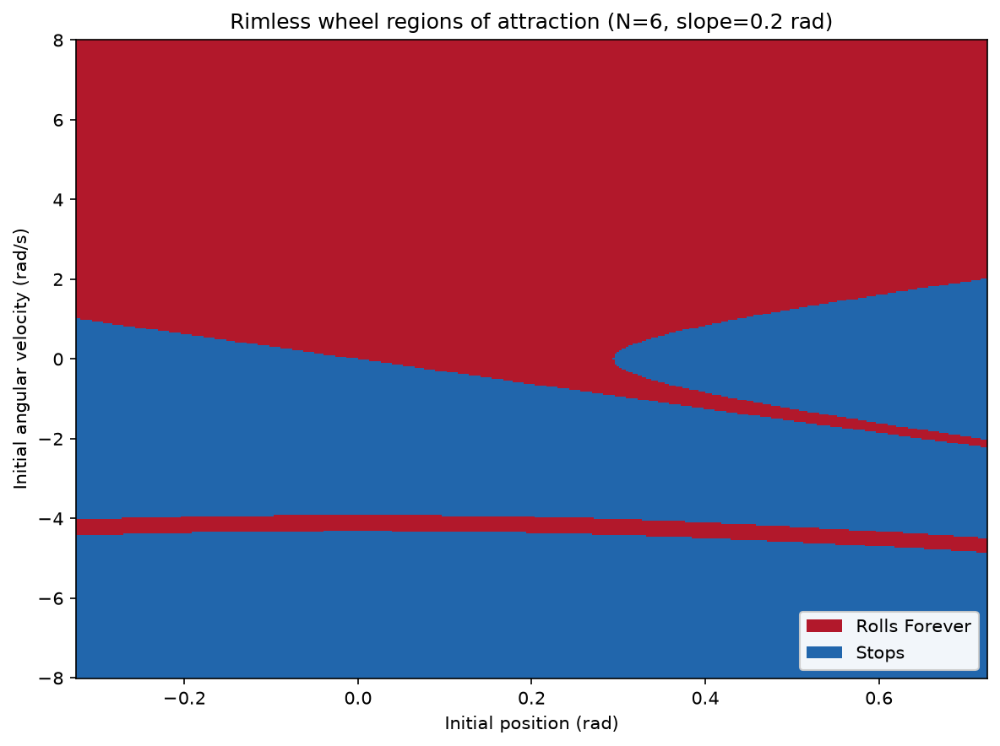
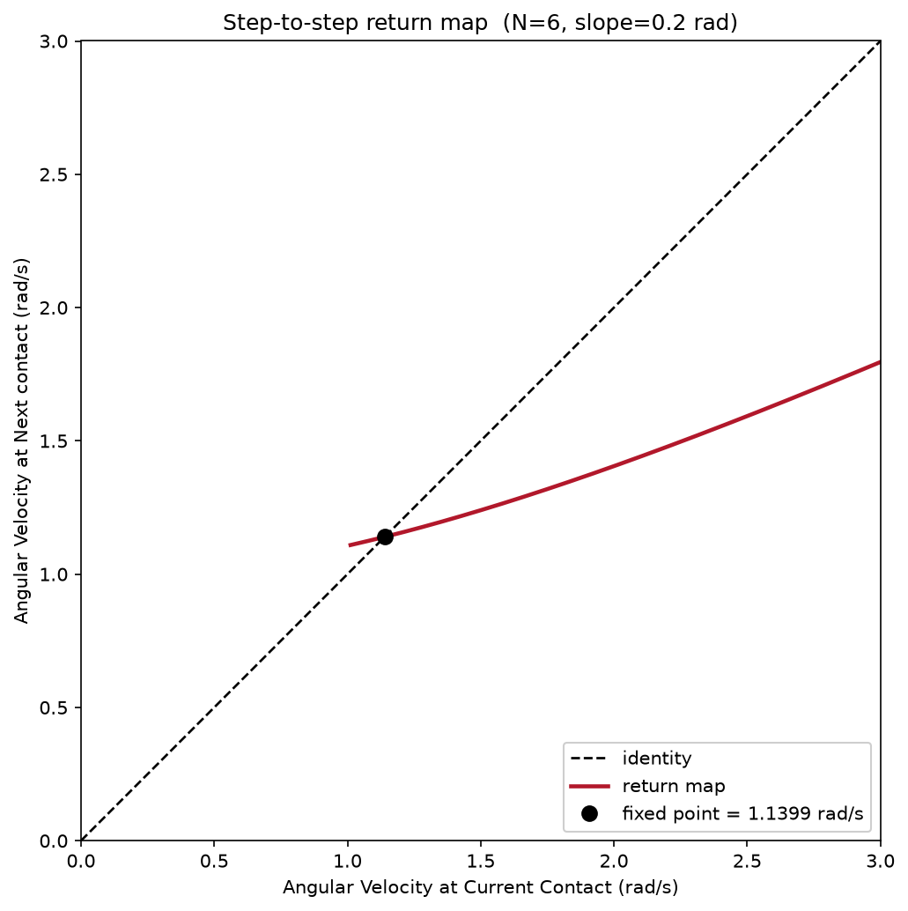
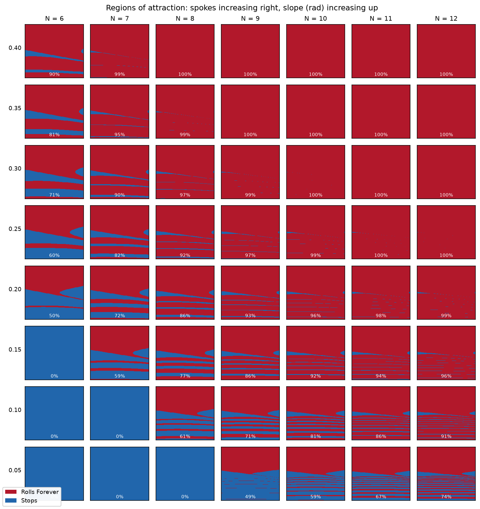
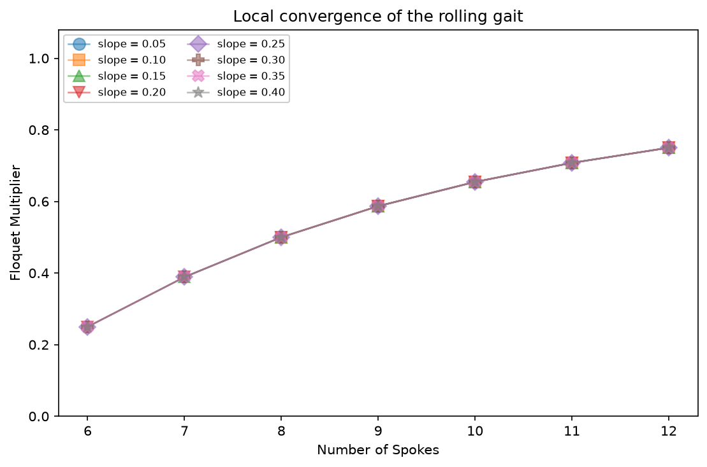

# tlw85 MAE 4110 Assignment 1

Wheel studied throughout: **N = 6 spokes, slope γ = 0.2 rad**, spoke length = 1m, Earth gravity. Every number below comes from the code in this branch.

## How to run

If you want everything, which are the printed numbers and all four figures, run:

```console
uv run python assignment_1.py
```

The pieces can also be run on their own:

```console
uv run python assignment_1_sanity_checks.py     # model checks, prints PASS/FAIL
uv run python assignment_1_plot_RoA.py          # regions of attraction
uv run python assignment_1_plot_return_map.py   # return map + Floquet multiplier
uv run python assignment_1_plot_sweeps.py       # slope/spoke sweeps
```

## The model

`models/rimless_wheel.py` holds the three pieces:

- **Stance dynamics** — an inverted pendulum about the contact point,
  `θ̈ = (g/L) sin θ`, with θ measured from the upward vertical.
- **Guard** — `detect_impact` returns `|θ − γ| − α`, the signed distance out of the
  stance interval `[γ − α, γ + α]` where `α = π/N`. It is zero when a spoke touches down.
- **Reset** — the landing spoke becomes the new origin: θ jumps one spoke spacing `2α` to the
  opposite end of the interval, and angular momentum about the new contact point is scaled by cos 2α

The analysis code utilizes an energy approach to solve the dynamics, this approach made the program run a lot faster while maintaining accuracy. 
## Sanity checks

`uv run python assignment_1_sanity_checks.py` — **6/6 pass**. What I expected in each
case, and what actually happened:

| Check | Expected | Measured |
|---|---|---|
| Stance energy is conserved | Drift below 1e-10; the stance phase is undriven | **1.95e-14** about E = 10.425834 |
| Impact law resets angle and scales velocity | θ → −0.323599 rad, ω → 1.000000 rad/s (from 2.0) | exactly those |
| Guard changes sign at the spokes | Negative inside, zero at both spokes, positive outside | −5.236e-01 / 0.0 / 1.1e-16 / +1.000e-01 |
| **Energy map matches full integration** | Post-impact velocities agree to better than 1e-9 | **worst error 4.21e-13** |
| Flat ground has no rolling gait | `swing_gain` exactly 0, every state stops | 0.0e+00, **100.0%** stop |
| Floquet multiplier equals cos²(2α) | Agreement better than 1e-6, independent of slope | worst error 2.15e-10 |

The most important check here is `advance_to_next_impact`, which verifies that I can indeed replace integration with energy. The check integrates `dynamics` with RK4, detects the guard crossing, bisects onto it with `find_impact_time`, applies the reset, and compares the post-impact velocity against the map, at launch speeds 1.2 / 1.5 / 2.5 / 4.0 rad/s and two timesteps. Agreement is within ~1e-13, more than satisfactory.

## Regions of attraction



Brute-force classification of a 401×401 grid over the full stance interval (−0.3236 to +0.7236 rad) and ±8 rad/s, stepping each state impact-to-impact until it resolves. **Two attractors**, which is what I expected for this system:

- **The rolling limit cycle** (red) — a period-one gait, one step per spoke, which shows up as the fixed point of the return map below at 1.1399 rad/s.
- **The standing fixed point** (blue) — the wheel fails to carry over the apex, rocks back, loses half its speed at each impact, and dies out leaning on a spoke.

## Return map



Using the contact event as a Poincaré section, with the post-impact angular velocity at the trailing spoke as the one-dimensional state. One step is

```
ω_{n+1} = cos(2α) · sqrt( ω_n² + 2(g/L)(cos θ_trailing − cos θ_leading) )
```

The square root is the energy picked up descending one spoke-width of slope, and the trig is the impact loss. Setting `ω_{n+1} = ω_n` and solving gives a closed form, so the fixed point is computed exactly.

The marker sits where the red curve crosses the dashed identity line. The curve is blank below 1.009 rad/s because that is the speed needed at the trailing spoke to reach the apex at all.

## Floquet multiplier

For a one-dimensional Poincaré map the Floquet multiplier is the slope of the map at its fixed point. Perturbing either side of ω* and taking a central difference:

| perturbation | 1e-3 | 1e-4 | 1e-5 | 1e-6 |
|---|---|---|---|---|
| estimate | 0.250000 | 0.250000 | 0.250000 | 0.250000 |

Identical to six decimals across three orders of magnitude of step size, so the numerical derivative is not sensitive to the choice.

**|multiplier| = 0.25 < 1, so the rolling gait is stable** — a disturbance in step speed shrinks to a quarter of itself each step, meaning the wheel forgets a perturbation within a few steps.

## How slope and spoke count affect the RoA and convergence



Spoke count increases to the right, slope increases upward; each cell is its own basin plot with the rolling percentage printed in it. Measured basin (% of the sampled window):

```
 slope    N=6   N=7   N=8   N=9  N=10  N=11  N=12
  0.40     90    99   100   100   100   100   100
  0.35     81    95    99   100   100   100   100
  0.30     71    90    97    99   100   100   100
  0.25     60    82    92    97    99   100   100
  0.20     50    72    86    93    96    98    99
  0.15      0    59    77    86    92    94    96
  0.10      0     0    61    71    81    86    91
  0.05      0     0     0    49    59    67    74
```

### 1. The dead region is a staircase, and spokes substitute for slope

The all-standing region is a lower-left triangle whose frontier steps left by one or two columns per row. That is because the slope at which a gait first becomes possible falls sharply with spoke count:

| N | 6 | 7 | 8 | 9 | 10 | 11 | 12 |
|---|---|---|---|---|---|---|---|
| critical slope (rad) | 0.178 | 0.106 | 0.068 | 0.047 | 0.033 | 0.025 | 0.019 |

An order of magnitude between N = 6 and N = 12. More spokes means a smaller turn per
step, so less speed thrown away per impact, so less slope needed to pay for it. The two
parameters are not independent knobs on the same quantity — adding spokes buys the same
thing adding slope does.

### 2. Slope moves the basin but not the convergence rate



Each series is one slope. They land on identical values, which is the point: **slope has
no effect whatsoever on the Floquet multiplier.** It climbs with spoke count only —
0.25 at N = 6 through 0.50 at N = 8 to 0.75 at N = 12 — following `cos²(2π/N)` exactly.

So the two parameters act on different things, and spoke count pulls in two directions at
once:

| | basin of attraction | convergence rate |
|---|---|---|
| steeper slope | grows, to saturation at γ = α | unchanged |
| more spokes | grows | **worse** (multiplier → 1) |

More spokes make the gait easier to fall into but slower to settle into.
